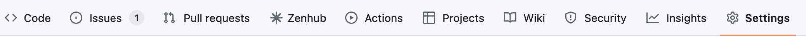
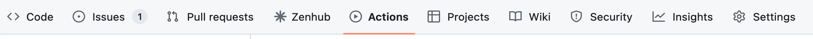

# training-specific-template

This repository is intended to serve as a template for creating a repository for an individual Data Lab workshop.
The repository structure and use of GitHub Pages is intended to gather all material required to administer a workshop in one user-friendly place.
We use a template repository approach for maintainability.

Please refer to [`CONTENTS.md`](./CONTENTS.md) for a brief overview of this repository's contents.

## Creating a repository for an individual training workshop

First, you will need to create a new repository using the [`Use the template` button](https://help.github.com/en/github/creating-cloning-and-archiving-repositories/creating-a-repository-from-a-template).
This will create a new repository with the same layout as this template repository under the user or organization you choose as the owner of the repository; if you are a Data Lab member running an internal training workshop, the `AlexsLemonade` organization should be the owner.

### Turning on required settings


1. Ensure you have the correct [visibility setting](https://docs.github.com/en/repositories/managing-your-repositorys-settings-and-features/managing-repository-settings/setting-repository-visibility) for your GitHub account tier.
    * If you are using GitHub from a **paid account tier** (e.g., GitHub Pro, GitHub Team, or GitHub Enterprise), you can set the visibility of this repository as either public or private; the associated GitHub Pages website will still be public.
    * If you are using GitHub from a **free account tier** (e.g., GitHub Free for individuals or organizations), you must set the visibility of this repository as **public** for [GitHub Pages to be active](https://docs.github.com/en/pages/getting-started-with-github-pages/about-github-pages).

2. Turn on workflow permissions for GitHub Actions.
    * There are several [manually-triggered GitHub Actions](https://docs.github.com/en/actions/using-workflows/manually-running-a-workflow) provided to facilitate setting up this new repository.
    * You must turn on "Read and Write" permissions for GitHub Actions to use them:
      * Navigate to the repository's "Settings" tab at the top of the page.
      <br><br>

      * Navigate to the `Actions` -> `General` page from the sidebar
      <br><br>

      * Ensure [the following settings](https://docs.github.com/en/repositories/managing-your-repositorys-settings-and-features/enabling-features-for-your-repository/managing-github-actions-settings-for-a-repository#configuring-the-default-github_token-permissions) are turned on:
        <br>
        


## Customizing the new repository for an individual training workshop

The first step of setting up up this repository is to run the [manually-triggered GitHub Action](https://docs.github.com/en/actions/using-workflows/manually-running-a-workflow) "Manually trigger issue creation for standard set up" GitHub action.
When triggered, this action will file a series of issues comprising tasks that should be completed before the start of a workshop.

Run this action as follows:

* Navigate to the repository's "Actions" tab at the top of the page.
<br><br>

* On the upper left-hand side, you will see all available workflows.
* Click the workflow named `Manually trigger issue creation for standard set up`, and then click the "Run workflow" dropdown button.
  * You will see a dropdown button "Use workflow from"; ensure this says the default branch `main`: 

To complete repository setup, address all issues filed by this workflow.

## Local development

It can be helpful to build the GitHub Pages site locally to check that passing parameter values is working as expected.

### Installing GitHub Pages dependencies locally

Installing the dependencies for GitHub Pages is best done in a separate ruby environment, managed by [`rbenv`](https://github.com/rbenv/) and [Bundler](https://bundler.io)

The following instructions were tested for installation on macOS, but installation on other systems should be similar.

1. [Install `rbenv`](https://github.com/rbenv/rbenv#installation).
The easiest, and recommended, installation is through [Homebrew](https://brew.sh/):
```
# install rbenv
brew update
brew install rbenv ruby-build
```
Alternatively, you can install with [`rbenv-installer`](https://github.com/rbenv/rbenv-installer#rbenv-installer) which will work even without Homebrew (though it uses Homebrew if you have it).

2. Install `rbenv` for your shell.
Since this will depend on which shell you are using, you will want to run `rbenv init` to find the correct command to add you your shell configuration file.
Note that this command does _not_ actually perform the initialization: it only prints instructions for what line to add to which file!
Be sure to add that line to the _end_ of the configuration file indicated.

4. Once you have modified your shell configuration, start a new shell to initialize `rbenv`.

5. Install a current stable ruby version
  ```
  # install and set up v3.1.3 of Ruby
  rbenv install 3.1.3 && rbenv rehash
  ```

6. Activate your ruby version. Here you have a few options:

   a. If you want to set the global ruby version that will be used wherever you use `ruby`, you can use
   ```
   rbenv global 3.1.3
   ```

   b. To only use this version of ruby within the repository only, navigate to the root of this repository and use:
   ```
   rbenv local 3.1.3
   ```
   This will create a `.ruby-version` file that will automatically activate this version of ruby whenever you are in this directory.

7. Now you should be ready to install Bundler:
```
gem install bundler
```

8. Finally, run `bundle install` from the root of this repository, where the `Gemfile` is located.
This will install all additional dependencies.

### Running a local jekyll server

Once all dependencies are installed, you should be able to start a local jekyll server with:

```
bundle exec jekyll serve
```

