For this training, we've set up a server that hosts RStudio and allows you to run computations more quickly with our machines.
In other words, you will be programming in R via this server, and _you do not need to download R or RStudio for this workshop._

In this tutorial, we will get you set up with our server.
Our [`intro-to-R-tidyverse` module](https://github.com/AlexsLemonade/training-modules/blob/{{site.release_tag}}/intro-to-R-tidyverse) contains lessons and resources for becoming more comfortable with R and RStudio for programming.
RStudio by itself is an [integrated development environment](https://en.wikipedia.org/wiki/Integrated_development_environment) (or IDE) that makes it easier to program in R.

### Logging in

To give you access to our RStudio server, we will send you a username and temporary password by direct message in Slack.
See [these instructions](./software-setup-instructions.md#joining-the-cancer-data-science-slack) for more information about setting up your Cancer Data Science Slack account.

Go to <https://rstudio.ccdatalab.org> and type in your username and temporary password, and click `Sign in`.
You may want to bookmark <https://rstudio.ccdatalab.org> for the duration of the workshop.

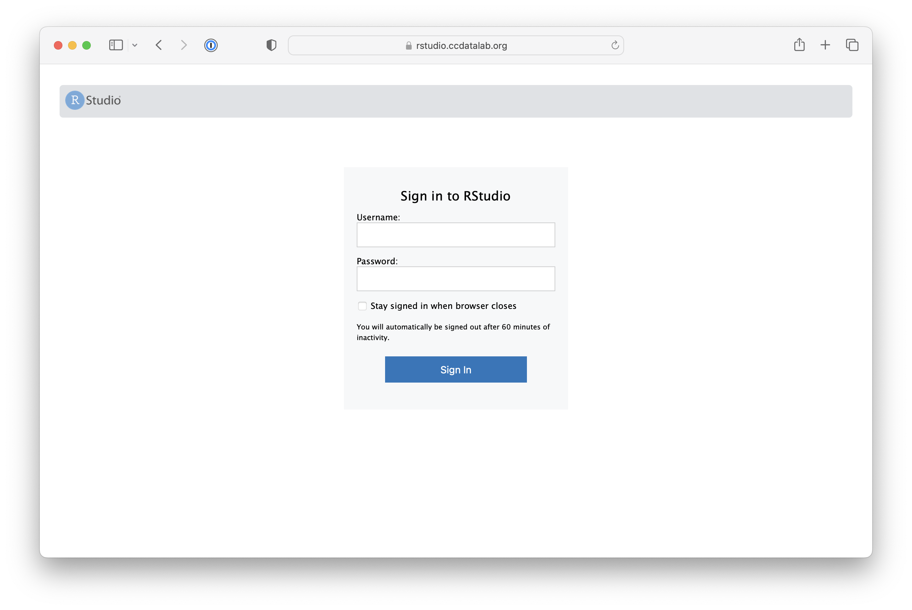

Signing in should bring you to the RStudio session page.
Click on the `Terminal` tab.

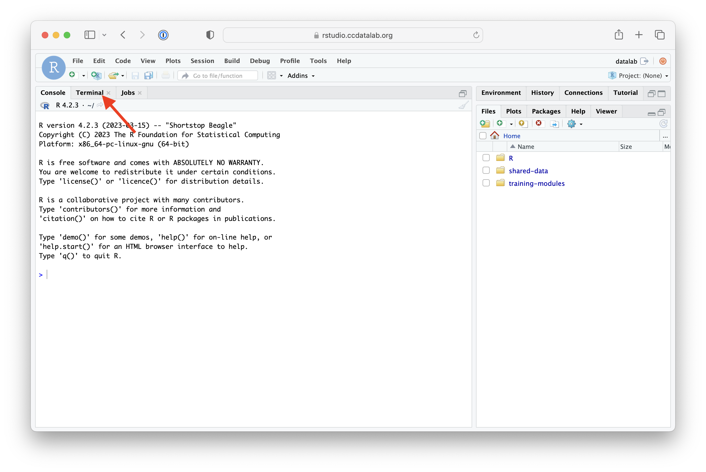

Type the `passwd` command in the `Terminal` tab.

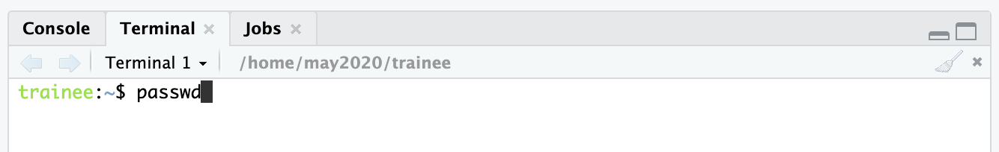

Press `Enter`. Then type in the password you were given in Slack.
Keep in mind, as you are typing in your password, no symbols will appear, but `Terminal` is receiving what you are typing.

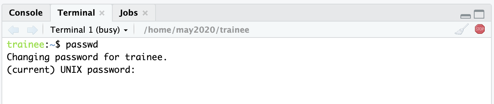

Type in the new password you've chosen once, and press `Enter`, then it will ask you to confirm by typing it in again.
Again, no text or dots will show as you are typing your new password.
Press `Enter` again to complete the password change.

To check that you have successfully changed your password, you may want to log out completely and log back in to the server.
If you look in the upper right corner of the screen, you should see a series of icons; the box with an arrow pointing out of it is the "Sign Out" button, and if you click that you will be returned to the login screen.
Re-enter your username and new password, and you should return to the session page.

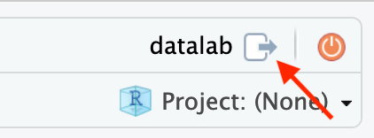

If you forget your password at any time, Slack one of the Data Lab team members to assist you.

## Stopping/Starting RStudio sessions

You can stop your current R session with the orange circular on/off button in the upper right corner:

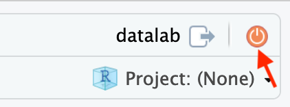
 
 

RStudio may ask you if you would like to save your current workspace.
In general, we advise choosing `Don't Save` so you can start fresh in your next session.

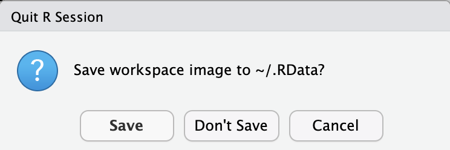
 
 

If you've made changes across multiple files, RStudio will ask you if you'd like to save your other files' changes.
Check off which files' changes you'd like to keep.
Note again that we recommend *not* saving the `.Rdata` Workspace file.

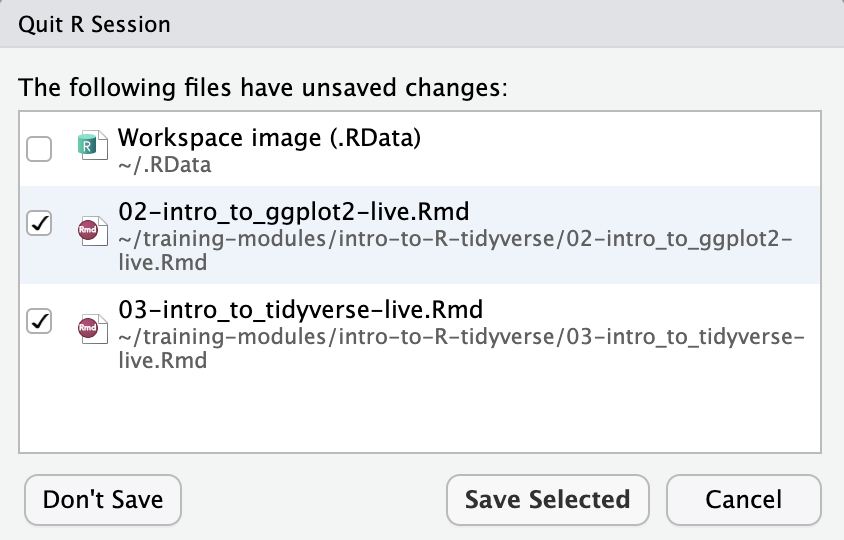
 
 

Stopping your R Session with the orange button will briefly show you this screen:

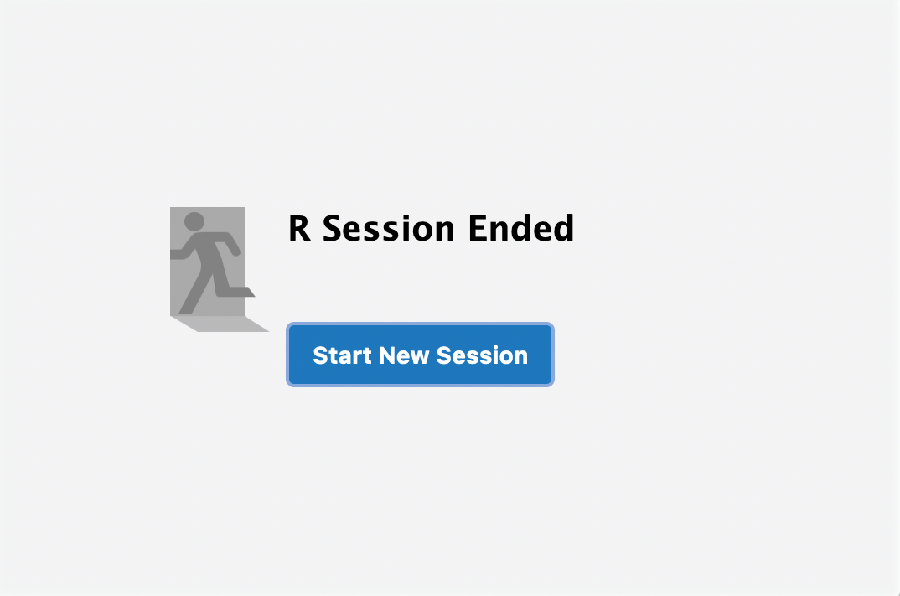
 
 

Click "Start a new session," and a fresh RStudio session will launch.

You will want to do this each time you switch to notebooks.

## Files on the server

Back on the session page, you are able to see the current files in your `home` directory in the `Files` tab in the lower right panel in your session.

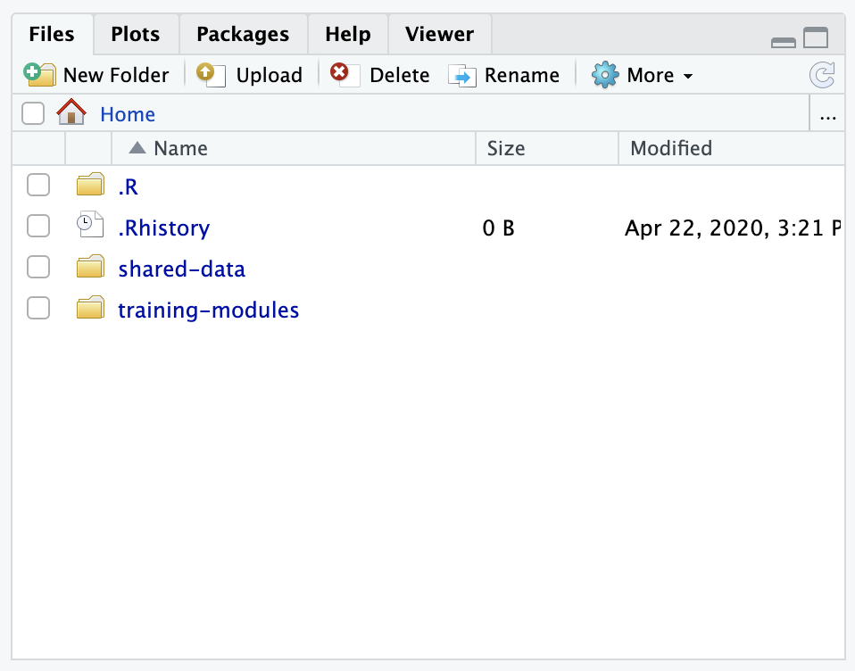
 
 

In your `home` directory, you will find the `training-modules` folder that contains our course materials and the `shared-data` that contains the data we will be using in the modules.
The files in these folders are accessible in each R session you start.
Starting and stopping R sessions will refresh what is in your `Environment` tab in the upper right panel.
We go into more detail on the R environment and other RStudio navigating tidbits in our [guide to RStudio](https://github.com/AlexsLemonade/training-modules/tree/{{site.release_tag}}/intro-to-R-tidyverse/00a-rstudio_guide.Rmd) as well as our [introduction to base R notebook](https://github.com/AlexsLemonade/training-modules/tree/{{site.release_tag}}/intro-to-R-tidyverse/01-intro_to_base_R.Rmd).

As always, please reach out to our Data Lab team through Slack if you have any questions!

## A troubleshooting note:

A not uncommon problem, upon trying to re-login to RStudio Server, is to see this screen:

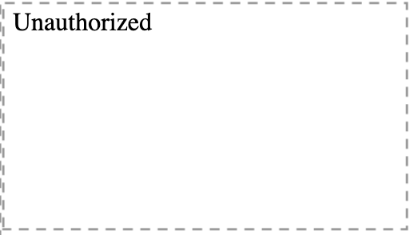
 
 

Quitting your internet browser completely and restarting it will *usually* remedy this.

To avoid this problem to begin with, it helps to log out of RStudio Server before leaving for the day.
You can log out by clicking the "Sign Out" button in your session page:

If this problem persists, please contact one of the Data Lab staff for assistance.
