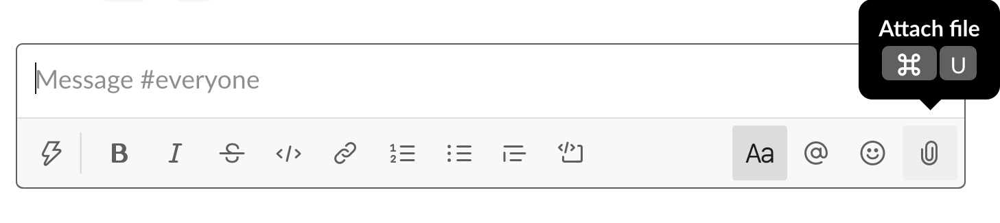

Specifically, we use the **Cancer Data Science Slack** team administered by the Data Lab.
See our [software setup page](software-setup-instructions.md#installing-slack) for full instructions on installing Slack and joining the Cancer Data Science Slack.

All Slack communications must adhere to our [code of conduct](../code-of-conduct.md).

**Table of contents**

* TOC goes here
{:toc}

## How we use Slack during workshops

Course instructors will add you to a private channel specific to your training a few days before the start of your training workshop.

If you are not added to the training specific channel by 3 days prior to the start of training or are having trouble getting started with Slack, please [direct message](#using-direct-messages-during-training) a Data Lab staff member (

`{{name}}`,  or `{{name}}`

) in Cancer Data Science Slack or email [training@ccdatalab.org](mailto:training@ccdatalab.org).

<br>

### Using the training-specific channel

#### Introduce yourself!

When you are added to the training-specific channel, please introduce yourself to others by messaging the channel with the following:

* Your name
* Your institution and position
* A brief summary of your research interests and what you are hoping to learn during training

#### General use

You can use the training-specific private channel to do the following:

* Post questions during lectures
* Post errors and get help with debugging
* Treat the channel as a study group – if you get stuck on an exercise notebook or your own data, post something so other participants and instructors can help you.

If you have a question, it's very likely someone else in the course has the same question!

**Responses to questions should be in [threads](https://slack.com/help/articles/115000769927-Use-threads-to-organize-discussions-) as much as possible**, including any screenshots or images.
To start a thread, hover over the message you want to respond to and click the start a thread icon that appears on the top right of the message:


You can then enter your response in the thread sidebar that appears on the right side of the Slack interface.
In general, you do not want to check the box that sends the message to the entire channel.

#### Collecting feedback

We also use the training-specific private channel to poll participants via [Polly](https://www.polly.ai/slack-poll). We collect the following feedback anonymously:

* The most difficult or confusing point of the module ("muddiest point"), which is posted anonymously to the channel
* What you liked about the module (anonymous, only instructors will see your answer)
* How we can improve the module (anonymous, only instructors will see your answer)

Use the `Submit Response` button in a Polly message to enter your feedback:


### Using direct messages during training

If you have a question that is **_highly specific_** to your own data or a problem with your RStudio credentials, you may [direct message](https://slack.com/help/articles/212281468-What-is-a-direct-message) a Data Lab staff member.

First, use the Plus sign button on the bottom left by your user icon, and select "Message" from the menu that appears (or, you can hit `cmd + N` to start a new message!):


You are then able to search for the Data Lab instructors –

 `{{name}}`, or `{{name}}` 

– and compose your message.

Course instructors may direct you to the training-specific channel for more general questions or to another instructor where appropriate.

## General Slack use

In this section, we include a collection of tips that you may find helpful for using throughout training that were not covered above.

#### Attaching a file or image

You can [add a file or image to Slack](https://slack.com/help/articles/201330736-Add-files-to-Slack) by clicking the plus sign on the bottom left of the message field:



#### Adding code blocks to messages

Code and error messages are usually easier to read when you use code formatting in Slack.
You can either select the code block icon below the message field:


Or you can type three backticks <code>```</code> into the message field and formatting will automatically be applied:


You are then ready to paste your code or error message into the gray code block.

**If you have questions or are having trouble with Slack features, please reach out to us via direct message or, if direct messaging is not working, please email [training@ccdatalab.org](mailto:training@ccdatalab.org).**
