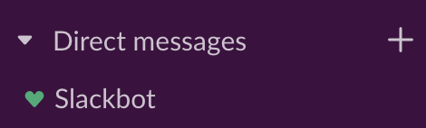

**Table of contents**

* TOC goes here
{:toc}

## RStudio Server

You will **not** need to install R or RStudio on your computer.
Instead, we have set up an RStudio Server for this workshop which you can access entirely via browser.
Please refer to [these instructions](rstudio-login.md) for setting up your RStudio Server account.



## Zoom setup instructions

We will use Zoom for all remote workshop sessions, as described in our [Workshop Logistics](../workshop/workshop-logistics.md) and [Zoom Procedures](zoom-procedures.md) pages.
### Installing Zoom

If you do not have Zoom installed yet, you will need to download the Desktop client from <https://zoom.us/download>.

### Enabling screen share

We will be making extensive use of Zoom screen sharing, both from our computers and yours.
It is important that you are able to share your screen with us so we can help you more easily in 1:1 consultation sessions or breakout rooms, and for the final presentations.

If you are working on a Mac, you will need to grant Zoom permissions to be able to use screen share, as follows:


Zoom's instructions are not yet updated for Ventura, but we could write instead:

Follow [this link](https://support.zoom.us/hc/en-us/articles/360016688031) for full instructions on how to grant Zoom these permissions, if you have not previously done so.


#### For macOS version 13 (Ventura) and higher

* Open "System Settings"
* Navigate to "Privacy & Security"
* Click "Screen Recording"
* Ensure the Zoom app is toggled on
  * If the Zoom app is not listed, click the plus sign to add Zoom to the list (you can find it in your Applications folder), and then toggle it on

#### For macOS version 12 (Monterey) and lower

* Open "System Preferences"
* Navigate to "Security & Privacy"
* Click "Privacy", and then select "Accessibility" from the sidebar.
* Ensure the Zoom app is toggled on in _both sections_: "Allow the apps below to control your computer" and "Screen Recordings"
  * If the Zoom app is not listed, click the plus sign to add Zoom to the list (you can find it in your Applications folder), and then toggle it on



## Slack setup instructions

We will use Slack to communicate with you both during and after the workshop, as described in our [Workshop Logistics](../workshop/workshop-logistics.md) and [Slack Procedures](slack-procedures.md) pages.

### Installing Slack

While Slack can be used directly from the browser at (<https://slack.com>), we recommend that you download Slack to be able to use its full features.
Download Slack from this link <https://slack.com/downloads>, which will automatically direct you to the download page for your operating system.

### Joining the Cancer Data Science Slack

Join Cancer Data Science Slack by navigating to <http://ccdatalab.org/slack> in your browser (you will have also received an email invite to join this Slack workspace).
If you have not created an account, follow the prompts to do so.
_Please use your full name in your profile, and don't forget to set a unique password!_

After you log in, you will see the Slack interface in the browser, but again we recommend using the Desktop version.
Slack might directly prompt you if you want to open the Desktop app (in which case say yes), but if not, you can launch the app directly.
In the upper left of the window, click on the words **Cancer Data Science** to open the setting menu, and the select "Open the Slack App".
(If you are on a PC, you may see the prompt: `Did you mean to switch apps?`; say `Yes`.

The Slack app you installed should open to the Cancer Data Science Community workspace and you should be all set.
After you have been added to the training-specific channel, say "Hi" and introduce yourself to everyone!

If you are new to Slack, you can get familiar with the interface and features by having a conversation with Slackbot (Slack's resident chatbot) or with yourself.
You can find Slackbot (and yourself) in the left panel, under "Direct Messages".

If you are having trouble setting up Slack, please reach out to us by email at <training@ccdatalab.org>.