We use the **Cancer Data Science Slack** workspace, administered by the Data Lab team, for communication.
If you haven't joined Cancer Data Science Slack yet, you will need to follow the [setup procedures described here](../software-setup/slack-procedures.md).

During and after the workshop, we encourage you to post your code error question to your Slack training channel.
But asking questions about code in such a way that others can readily help you can be tricky and is a skill in itself!

Here we've laid out guidelines for posting your question so that your peers and the Data Lab team will readily be able to help you find a solution.
Following these guidelines will take more time but it will increase your chances of getting speedier responses that more adequately help you resolve your error!

**Table of contents**

* TOC goes here
{:toc}

## What information should a question about code include?

We consider the themes of a good troubleshooting post to be `context` and `specificity`.
The more context you can provide, and the more specific you can be about your problem, the easier it will be for someone to help you.

**Your posted code question should include:**

- Where is this error occurring (notebook/chunk)?
- What is the goal of this code?
- What is the code that is producing this error?
- What is the error or problematic outcome?

*Optionally:*
- What things have you tried thus far?

To demonstrate what we mean by these guidelines we will walk through an example.

## A troubleshooting example

In this example, we're using our exercise notebook `exercise_02-intro_to_R.Rmd`, which is part of our `Introduction to R and Tidyverse` training module.

Below is a screenshot of what this error would look like when encountering it on [our RStudio Server](../software-setup/rstudio-login.md).

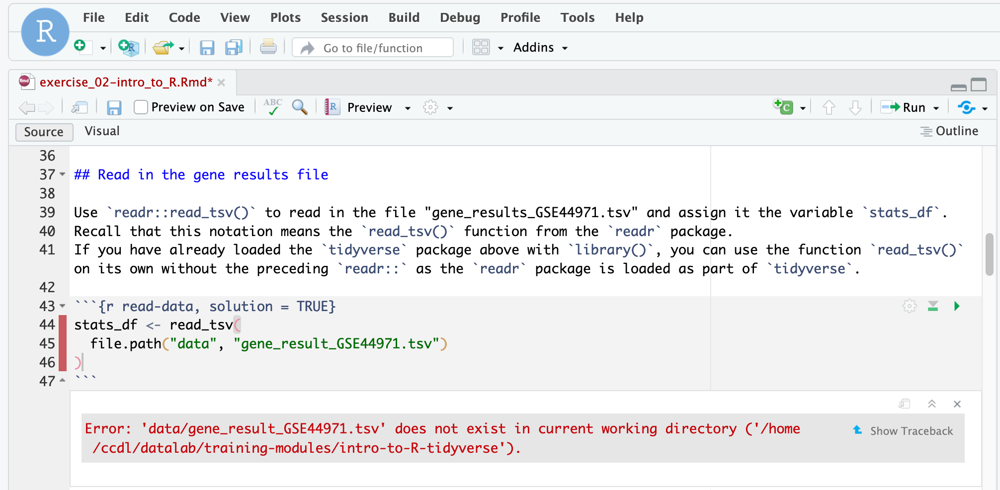

### Step 1) Do what you can to try to solve the error yourself (but don't tire yourself out!)

The best way to learn how to solve errors in code is to figure them out yourself.
So try to explore the error a bit - but we are also here to help you so don't hesitate to ask for help!
(_If you are feeling exasperated by your error, skip to Step 2_).

We recommend looking over our [debugging guide](https://github.com/AlexsLemonade/training-modules/blob/{{site.release_tag}}/intro-to-R-tidyverse/00b-debugging_resources.Rmd) which can explain what some of the most common errors mean.
The debugging guide also has tips on first steps to take which may help you get to the root of the problem.

**A short list of things to try:**

- Try to identify which part of your code appears to be the problem through trying smaller parts of the code and seeing if the error still occurs (called chunking, a term _unrelated_ to R code chunks).
In the chunking example below, each highlighted portion is something you could run by itself to test.
(Using `Command + Enter` in RStudio will run what you have highlighted. On Windows or Linux systems it may be `Crtl + Enter`).

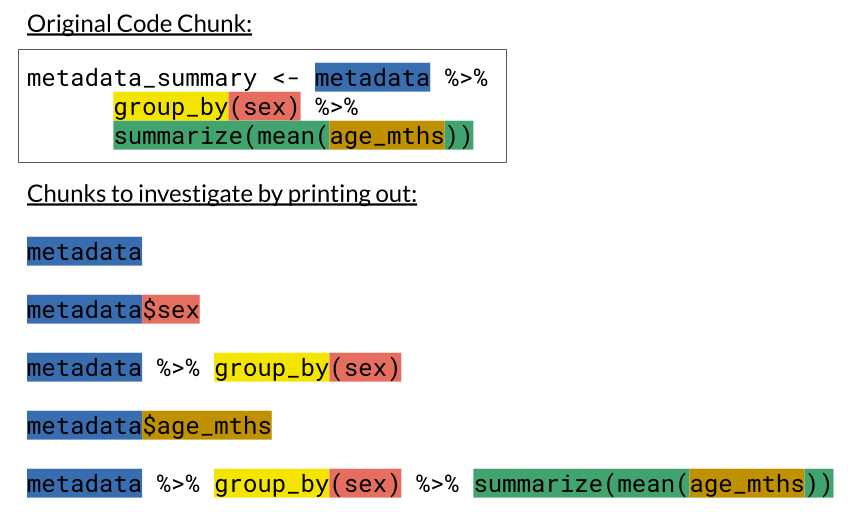

- [Restart your R Session](../software-setup/rstudio-login.md#stoppingstarting-rstudio-sessions) and go back to the beginning of your notebook to re-run all of your code in order to make sure you haven't missed any vital steps! Order matters!

### Step 2) Draft out the description of your error post.

You may want to open up a text editor to write this out before posting, as a matter of personal preference.

For our example error, here's how each of the "four points" (and the optional one) could be included in your posted question; we will go through the details on each point:

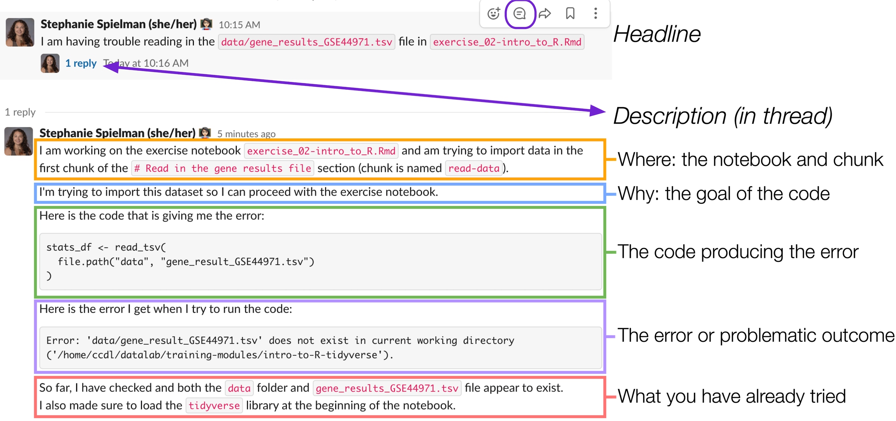

#### Where is this error occurring; what notebook/chunk?

- In our workshop, notebook references tend to make sense to provide, however, more generally this should be any context around __where__ you've encountered this error.

- If you are *not* working from any Data Lab materials, it is *even more important* to provide context around what the notebook you are creating is supposed to be doing.

- Note that line numbers change as you've added code, so line numbers as a reference aren't as helpful.

*For our example:*


#### What is the goal of this code?

- Describing your end goals for this code will provide context for others so they can tailor their advice with your goal in mind.
    *Examples of information you may want to include (whenever it is applicable):*
    - What is your scientific question?
    - What does your input data look like?
       - What kind of file *e.g.* `.TSV`, `.fastq`?
       - What information is included the data?
       - What are the columns?
       - What are the rows?
    - What's your desired output?
       - What kind of results are you looking for e.g. a plot, a table, processed/filtered data?
       - What kind of file *e.g.* `.TSV`, `.fastq`?

- Sometimes you can bypass an error completely by using an alternative strategy altogether, but your helper won't be able to suggest an alternative if they don't know your ultimate goal.

*For our example:*


#### What is the code that is producing this error?

- [Use code blocks or backticks (```) to format your code](../software-setup/slack-procedures.md#adding-code-blocks-to-messages).
Formatting your code makes it easier for others to distinguish between your code and the words in your post where you are otherwise describing the problem.

- It's helpful if you copy/paste the error message into Slack rather than posting a screenshot, so others can copy/paste for Google searching. (A reminder to also try Google searching yourself before posting - It's often surprisingly helpful!).

*For our example:*

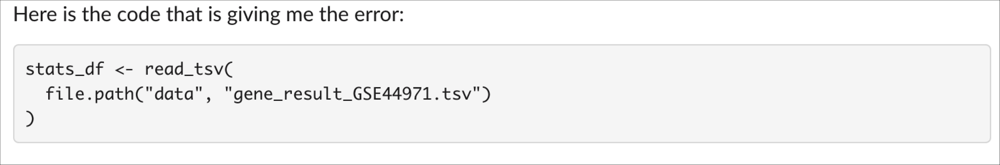

#### What is the error or problematic outcome?

- Include any error messages **verbatim**.
  - It's also helpful if you copy/paste (no screenshot) your error and [format it as a code block](../software-setup/slack-procedures.md#adding-code-blocks-to-messages), just like you shared the code itself.
- If you don't have an error message _per se_, but do have something else that is not working as expected, describe what isn't working and how you found it.
     - *Example*: "This data.frame I'm showing in my code called `cool_df` doesn't have row names when I look at it in my environment panel".
- Context around when the error appears versus when it does not can be helpful clues to your reader.

*For our example:*

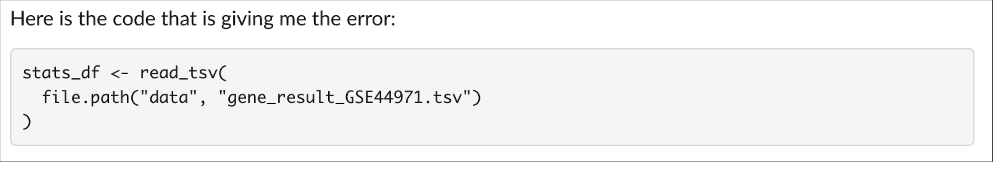

#### (Optional) What have you tried thus far?

- This is considered an optional point because we understand you also may not know where to begin (and that is definitely okay - we are here to help!)

- If you have tried some things to fix the problem, it can be helpful for others to know what you've tried and narrow down on what the problem might be.

- If you have tried solutions you have found posted online, including the links to those solutions is helpful.

*For our example:*


### Step 3) Post to Slack!

First, navigate to your particular workshop's training channel.

#### Step 3a) Post the headline of your problem.

To keep new questions and responses from getting lost in the messaging board, we strongly encourage you to make a "headline" that is one post and put the longer description you crafted in step 2 in the thread of your headline.

*For our example:*

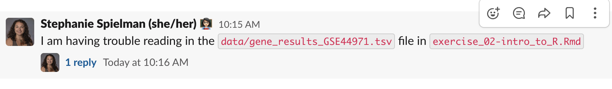

To navigate to Slack threads, you can can click speech bubble in the corner of your post:

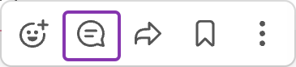

You should try to keep all further messages and correspondence about that question in the same Slack thread.
Follow up problems in the same section of code should also be kept to this same thread you started.
#### Step 3b) In the thread of your headline, post the description you crafted in [Step 2](#step-2-draft-out-the-description-of-your-error-post).

Navigate to the Slack thread of your "headline" post.

If you wrote out your error description in a text editor, it may have looked like this, where backticks we can turn into code chunks after we copy-paste it in Slack:

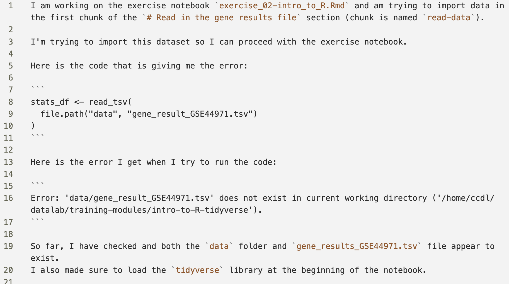

When you are typing out your error description you may find it helpful to have our "four points" handy.
We've included [a checklist you could use for creating your post](#checklist-for-posting-a-code-error-question) for this purpose.

When you paste your text into Slack, it may ask if you'd like to `Apply formatting`. Click `Apply`.
If Slack doesn't ask you about formatting for some reason, you can also hit **`Shift + Command + F`** to apply the formatting.

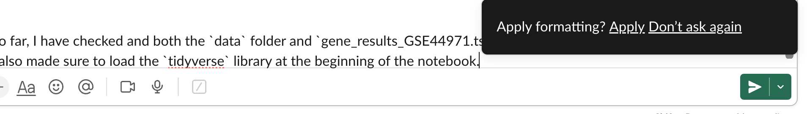

Either method will format your post like below:

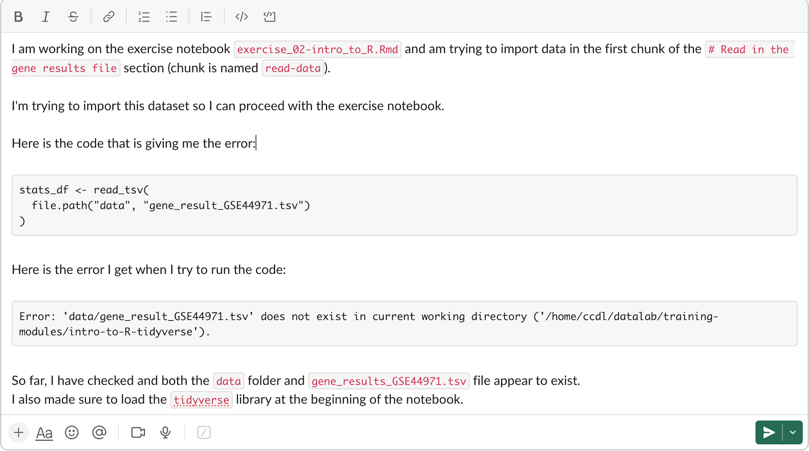

If all looks set, click the green arrow to add it to the thread!

**Slack Tip:** if you see a mistake in your post you missed, you can click on the three dots in the corner of your Slack post.
Choose `Edit message` from the dropdown menu that appears, and fix the mistake.

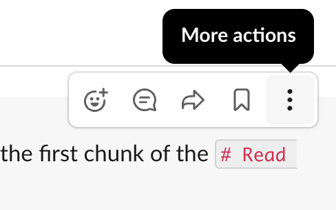

### Step 4) Look for responses (in the same thread)!

You'll see a total count for how many replies are in your thread; for example, here there are two replies, including one that might have helpful advice!


Scroll through to see the reply:

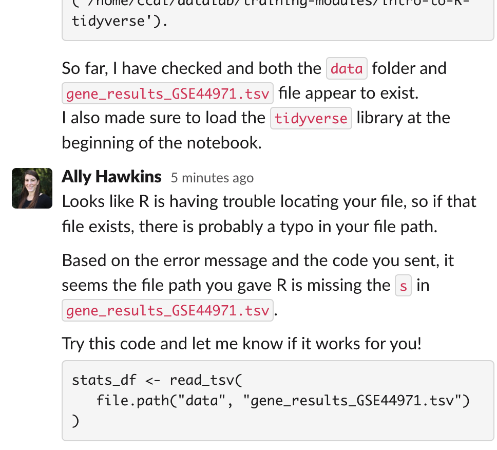

Lastly, it is helpful for the person who has responded to you or others who might have the same problem if you can remember to post on the thread if/how you resolved the problem!

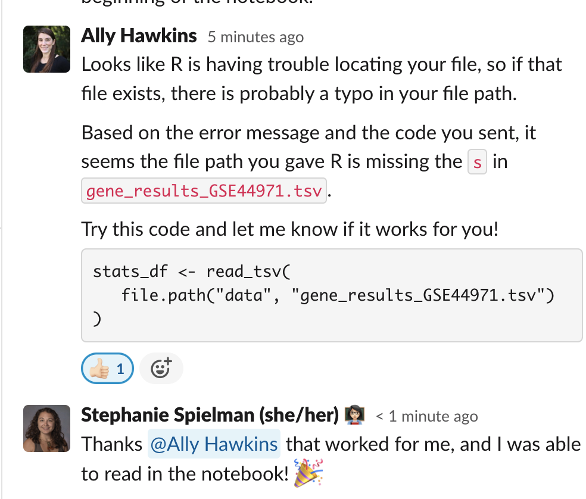

Congrats on solving your error! 🎉

## Checklist for posting a code error question

*Here's a checklist you can use to craft your question post:*

- [ ] What is the goal of this code?
- [ ] Where is this error occurring (notebook/line/chunk)?
- [ ] What is the code that is producing this error?
- [ ] Is the code formatted?
- [ ] What is the error or problematic outcome?
